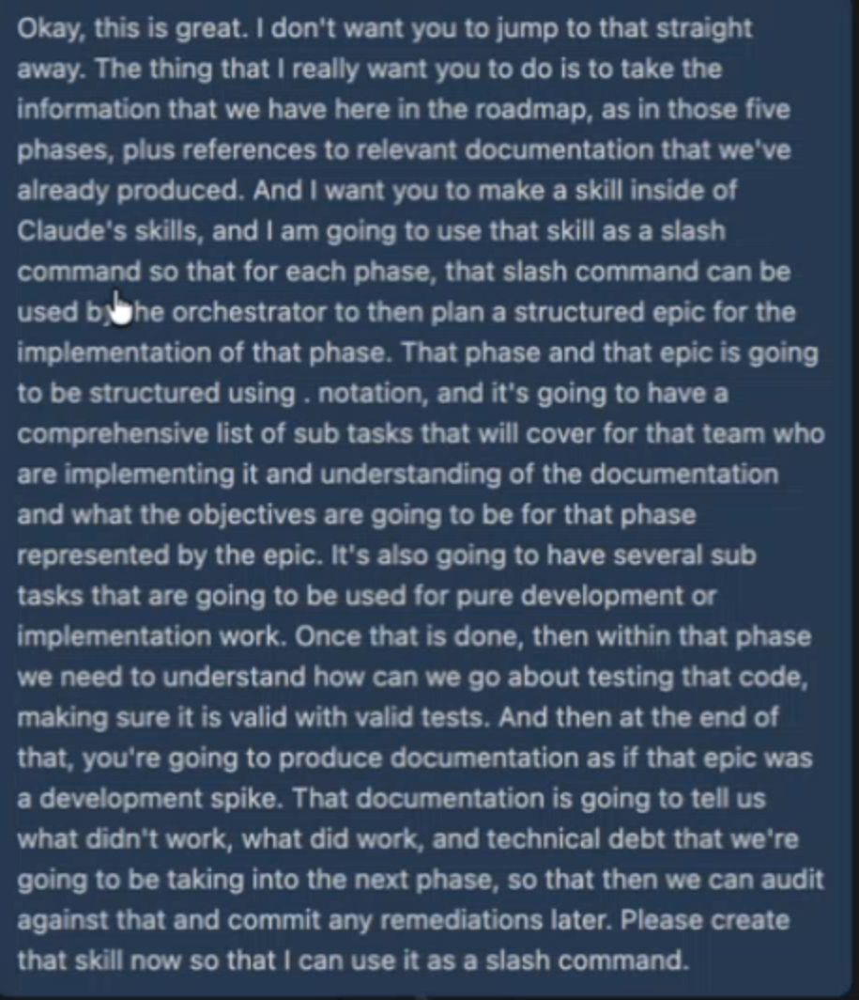

Copilot steps

`/init`
`please run backlog init for this project`
`please create the mcp.json file for backlog`
`merge the contents from CLAUDE.md into copilot-instructions.md`
`/clear`
`/models`
```
Hi. We're now going to setup our coding system. I want it to be a system that uses two types of agents.

1) Agent one will be an orchestrator that acts as the technical lead. The orchestrator is defined by a skill in .github/skills and will only work through the backlog (MCP). It will work with the user to understand the intent, objectives and requirements for the project, and then use that to define the work in the backlog. The orchestrator should use dot notation when creating task ids in the backlog where the name is 'task'-epic#-task#.  This agent MUST NOT DO ANY DEV WORK DIRECTLY.

2) Agent two is the subagent that will be called by the orchestrator and will do work that is described in the backlog. The backlog is the only medium that the requirements can be described to the subagent. If code is written then unit tests must also be written.  

Finally, please edit the copilot-instructions.md file that describes how this system works.

TO create the agents lookup best practies for skills from anthropic.
```

`add this anthropic skill to the project: https://github.com/anthropics/skills/blob/main/skills/frontend-design/SKILL.md`

```
We're going to start a project today that will host an application that generates messages to multiple confuent kafka clusters in multiple azure regions and availaibility zones. The first thing I want you to do as the technical lead is to create an epic that has several subtasks all created under epic 1. The purpose of the epic is to research best practices on how to build multi-region and multi-availability zone confluent kakfa clusters in azure running on virtual machines. Use the developer subagents to go to the internet, ao all that research, come back, build out comprehensive documentation as to the approach to deploy and run confluent kafka in azure. For now all I want you to do as tech lead is to build that epic and subtasks as a plan for this research and design epic. Do not do anything else. Once complete, pause.
```

`/fleet You are the tech lead. Please use the orchestrator skill to invoke the developer subagents to complete epic 2 and all the tasks for epic 2. Accomplish all subtasks with your team autonomously`

```
You are working very effectively through the tasks in the backlog, but, the agents are not committing their work to git. Please create a new skill about adhereing to good git hygiene making sure that after each task is completed successfully there is a related git commit. Pleaes update the copilot-instructions for this general project direction, update the orchestrator skill to follow this practice and update the developer agent to follow this practice.
```



```
 /grill-me Please create a new skill named backlog-decision. Do research for software decision making and documentation process to include the best practices
  for software decision making process. Make sure to include tags so the decisions can be queries and organized for appropriate teams
```
based on customer requirements and the great research you've completed,  we need to make some decisions.  

```
/backlog-decision Create a decision for the Azure naming convention. All azure resources will be prefixed with three letters (customer prefix) followed by five
 to 10 characters for the azure component followed by and parent resource as applicable (excluding tenant, sub and rg) followed by region.
 ```

 `/grill-me Based on the great research you've done and the decisions taken, we want to create a multi-phase implementation plan to get confluent kafka running in azure.`

 ```
 /write-a-skill Before we start to create backlog, I want you to take this four phase roadmap plus references to the existing decisions and research and have you create a new skill that can be called plan-phase. This skill will take a number as
input which represents the phase to be executed. This skill will be used by the orchestrator at the beginning of each phase to then plan a structured epic for the implementation of that phase. the epic will use . notation with a comprehensive list
of sub tasks that will cover what the developer agents are implementing and servce as the documentation for what objective are going to be for the phase. There will be several sub tasks that are going to be used for pure development or
implementation work. Once that is done, then within that phase we need to udnerstand how we can go about testing the code, make sure things are running with valid tests. And then at the end you're going to produce documentaon as if that epic was a
development spike .The documentation is going to tell us what worked, what didn't work and technical debt that will be taken into the next phase so we can audit against that and commit remediations later. Please create that skill now so I can use
it as a slash command.
```

`/fleet you are the technical lead need to use the orchestrator skill to delegate all epic 3 (task3) subtasks to developer agents. Work autonomously until all subtasks are created in this epic`